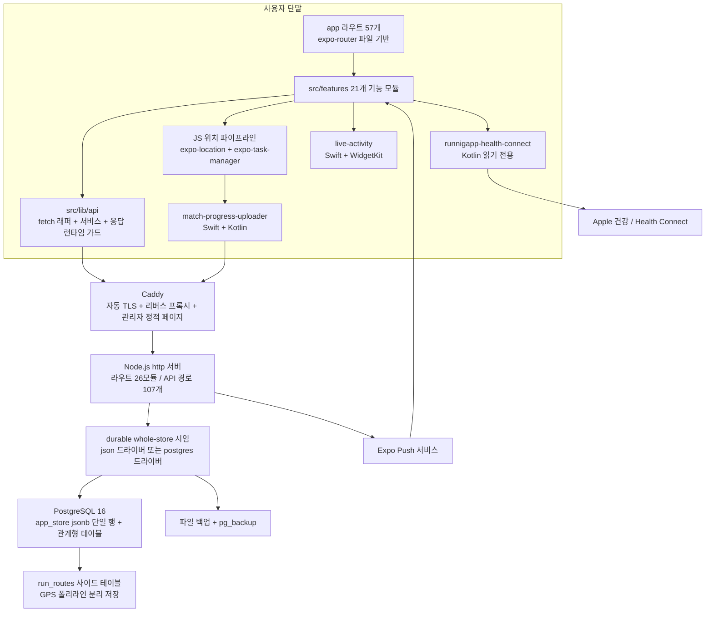
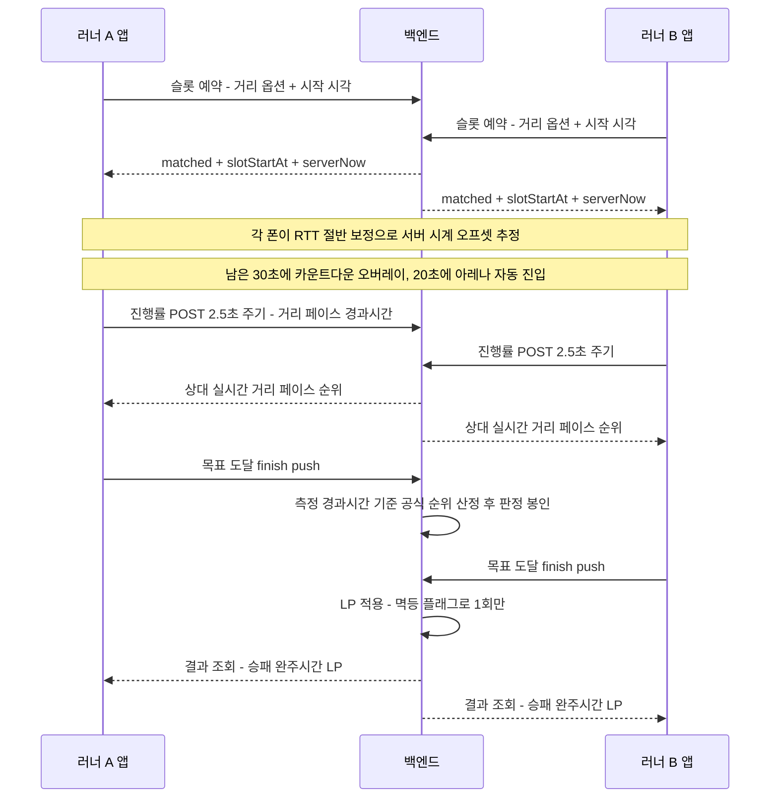

# 러닝그라운드 아키텍처·기능 개요

> 기준: 이 저장소의 커밋 `bf086278`(2026-09-19). 이 문서의 모든 수치는 해당 시점의 트리를 `find` / `wc` / `grep`으로 직접 세어 얻은 값이며, 확인되지 않은 항목은 싣지 않았다.

## 무엇인가

GPS로 러닝을 측정하고, 그 기록을 다른 러너와 **실시간으로 겨루는** iOS/Android 앱이다. 혼자 뛰는 기록 앱과 다른 점은 "같은 시각에 같은 거리를 두고 두 대 이상의 폰이 동시에 달린다"는 것이고, 그래서 제품의 난이도는 러닝 측정보다 **두 기기 사이의 시간·거리 합의**에 몰려 있다.

1대1 대결·그룹 대결·파티런(친구 초대방, 방장 시작 또는 예약 시작)·페이스메이커·자신과의 대결 같은 경쟁 모드와, 지역/친구 랭킹, LP 기반 랭크 사다리(입문 → 러너 → 페이서 → 레이서 → 엘리트), 월간 크루 리그, 친구와 기간을 정해 포인트를 거는 그라운드, 달리는 친구를 지도로 보고 음성으로 응원하는 기능, 건강 앱 기록 가져오기를 하나의 Expo 코드베이스에서 다룬다. 앱·백엔드·자체 네이티브 모듈·배포 파이프라인까지 한 저장소 안에 있다.

탭바는 랭킹·크루·러닝·홈·친구·기록·마이 7개다. 탭바에서 내린 화면(3D 스페이스 탭, 마켓·레이스 탭)과 플래그로 끈 경찰과 도둑 모드의 코드는 라우트와 함께 남아 있어 아래 수치에 포함된다.

## 기술 스택

| 영역 | 사용 기술 | 비고 |
| --- | --- | --- |
| 언어 | TypeScript 5.9 (앱), JavaScript ESM (백엔드), Swift / Kotlin (네이티브) | 백엔드는 `.mjs` 단일 모듈 시스템 |
| 앱 프레임워크 | Expo SDK 54, React Native 0.81.5, React 19.1, New Architecture 활성화 | `app.json`의 `newArchEnabled: true` |
| 라우팅 | expo-router 6 (파일 기반), `typedRoutes` 실험 플래그 | `app/` 57개 라우트 |
| 앱 주요 SDK | expo-location, expo-task-manager, expo-sensors, expo-notifications, expo-secure-store, expo-updates, expo-speech, expo-audio, react-native-maps | 위치·백그라운드 작업·케이던스·푸시·세션 저장·OTA·음성 응원 |
| 상태/데이터 계층 | 자체 API 클라이언트 ([`src/lib/api`](../src/lib/api)) — fetch 래퍼 + 타임아웃 + 응답 런타임 가드 | 외부 상태 관리 라이브러리 없음 |
| 백엔드 런타임 | Node.js ≥ 20, **프레임워크 없이 `node:http`** | 런타임 의존성 2개: `pg`, `solapi` |
| 백엔드 구조 | 라우트 모듈 26개 / API 경로 107개, 순수 로직 라이브러리 91개 모듈, 리포지토리 계층 + 스토어 시임 | [`backend/src/routes`](../backend/src/routes), [`backend/src/lib`](../backend/src/lib), [`backend/src/repositories`](../backend/src/repositories) |
| DB | PostgreSQL 16 — 테이블 16개 | [`backend/db/schema.sql`](../backend/db/schema.sql) |
| 스토리지 드라이버 | `BACKEND_STORE_DRIVER`로 `json` / `postgres` 선택, 동일 async 인터페이스 | [`backend/src/storage/index.mjs`](../backend/src/storage/index.mjs) |
| 네이티브 모듈 | 자체 Expo 모듈 3개 + iOS Widget Extension 타깃 1개 (Swift/Kotlin 14파일) | 아래 "시스템 구조" 참고 |
| 모니터링 | `@sentry/react-native` | DSN은 클라이언트 식별자라 코드에 있지만, 공개 사본에서는 자리표시자로 치환 |
| 테스트 | `node:test` — 앱은 `tsx --test`, 백엔드는 `node --test` 직접 실행 | 테스트 파일 302개 |
| 빌드/배포 | EAS Build, EAS Update(OTA), TestFlight / Play Console | `eas.json`에 development / preview / testflight / production 프로파일 분리 |
| 서버 배포 | Docker Compose 3서비스 — `postgres:16-alpine` + api + `caddy:2-alpine` | Caddy가 자동 TLS + 리버스 프록시 + 정적 관리자 페이지 서빙 |
| 릴리스 게이트 | `release:check`, `release:gate:*`, `code:quality`, `perf:smells` npm 스크립트 | 빌드 전 환경변수·품질·성능 스멜 검증 |

## 시스템 구조



**라우트는 껍데기, 로직은 features에.** `app/` 59개 파일의 총 줄 수가 **391줄**이다. 라우트 파일 하나가 사실상 한 줄이고, 화면 구현은 전부 `src/features/*`에 있다.

```tsx
// app/(tabs)/running.tsx — 파일 전체
export { default } from '@/features/running/screens/RunningScreen';
```

이 규칙 덕분에 expo-router의 파일 규약(탭 그룹, 딥링크 경로)과 화면 구현이 서로를 오염시키지 않고, 화면을 다른 경로로 옮길 때 import 경로만 바뀐다.

**백엔드는 프레임워크가 없다.** `node:http` 위에 라우트 핸들러 배열을 순회하는 얇은 디스패처([`backend/src/routes/index.mjs`](../backend/src/routes/index.mjs))를 두고, 각 라우트 모듈이 `pathname === '...'`으로 자기 경로를 처리하면 `true`를 돌려준다. 경로 매칭이 전부 정확 일치라 라우팅 테이블 전체를 `grep` 한 번으로 셀 수 있다(107개).

**스토어는 하이브리드다.** 프로젝트는 JSON 파일 스토어로 시작했고, Postgres 전환을 "전체 재작성"이 아니라 **어댑터 교체**로 처리했다. [`backend/src/storage/index.mjs`](../backend/src/storage/index.mjs)가 드라이버를 고르고 동일한 async 인터페이스를 노출한다. Postgres 드라이버는 같은 whole-store를 `app_store` 테이블의 jsonb 단일 행으로 보관하고, 동시 쓰기는 그 행의 `SELECT ... FOR UPDATE` 락으로 직렬화한다.

여기서 걸린 실제 성능 문제와 처방이 이 계층의 존재 이유를 잘 보여준다. 저장된 러닝의 GPS 경로(최대 수백 KB)가 blob 안에 들어 있어서, 매치 중 2.5초마다 오는 진행률 POST가 **러닝 히스토리 전체를 다시 직렬화하는 행 쓰기 뒤에 줄을 섰다**. 경로는 표시용 폴리라인일 뿐 판정·LP·포인트가 읽지 않으므로 `run_routes` 사이드 테이블로 빼고 blob에는 마커만 남겼다([`backend/src/storage/postgresStoreAdapter.mjs`](../backend/src/storage/postgresStoreAdapter.mjs)).

**자체 네이티브 모듈 3개** (`modules/`):

| 모듈 | 플랫폼 | 하는 일 |
| --- | --- | --- |
| `match-progress-uploader` | iOS Swift + Android Kotlin | 화면이 꺼져 JS 스레드가 잠든 동안에도 진행률을 서버로 재전송하고, GPS 픽스로 거리를 계속 누적한다. Android 쪽은 **자체 포그라운드 서비스 + PARTIAL_WAKE_LOCK**을 들고 3초 주기 업로드 루프를 스스로 돈다 |
| `runnigapp-health-connect` | Android Kotlin | Health Connect의 러닝 세션과 거리 샘플을 **읽기 전용**으로 집계. 쓰기는 하지 않는다 |
| `live-activity` | iOS Swift | 잠금화면 Live Activity / Dynamic Island 카드. JS 브리지는 배포되어 있고 네이티브 위젯 타깃([`targets/live-activity`](../targets/live-activity))이 함께 있다 |

세 모듈 모두 **OTA 안전 게이트**를 공유한다. 네이티브 함수는 전부 optional로 선언되고, JS는 `typeof` 가드로 존재 여부를 확인한 뒤 없으면 무동작으로 떨어진다. 구버전 바이너리에 새 JS 번들을 OTA로 내려도 깨지지 않게 하기 위한 설계다.

```ts
// modules/match-progress-uploader/index.ts
//   OTA-SAFETY marker — ONLY the REAL native module ... sets this to true.
available?: boolean;
startPeriodicUpload?(url: string, authToken: string, jsonBody: string, intervalMs: number): void;
```

## 실시간 매치가 도는 방식



### 1. 카운트다운 동기화 — 두 폰이 같은 순간에 0을 본다

가장 어려웠던 문제다. 두 기기의 시스템 시계가 수백 ms씩 어긋나면 "한쪽은 이미 출발했는데 다른 쪽은 아직 3을 세고 있는" 상태가 된다.

해결의 핵심은 **서버 응답마다 NTP 스타일 클럭 필터를 돌리는 것**이다([`src/features/runs/sync/serverClockSync.ts`](../src/features/runs/sync/serverClockSync.ts), 352줄). API 클라이언트가 요청 시작/응답 수신 시각을 함께 실어 주고, 각 응답의 `serverNow`로 오프셋 샘플을 만든다.

```ts
// src/features/runs/sync/serverClockSync.ts
return {
  serverNowMs,
  offsetMs: Math.round(serverNowMs + rttMs / 2 - responseReceivedAtMs),
  rttMs,
};
```

여기에 얹힌 규칙들:

- **최저 RTT 샘플 선택** — 샘플마다 편도 지연 비대칭 때문에 ±RTT/2의 불확실성이 있으므로, 최근 샘플 버퍼에서 *가장 최근*이 아니라 *RTT가 가장 작은* 샘플을 신뢰한다.
- **유계 크롤** — 늦게 도착한 스냅샷이 카운트다운 숫자를 한 프레임에 몇 초씩 점프시키지 못하도록 한 번에 움직일 수 있는 폭을 제한한다.
- **콜드 스타트 스냅 + 품질 게이트** — 첫 신뢰 샘플은 크롤을 건너뛰고 즉시 스냅하되, 그 샘플의 RTT가 나빴다면 더 좋은 샘플이 오면 한 번 더 스냅한다. 안드로이드에서 JS 스레드가 붐빌 때 첫 응답 처리가 늦어져 오프셋에 오차가 각인되던 문제 때문에 들어갔다.
- **clockReady 게이트** — 신선한 샘플 여러 개가 서로 일치해야 "시계 준비됨"이 되고, 그 전까지 카운트다운 잠금이 목표 시각을 동결하지 못한다.

카운트다운 잠금이 고정하는 값은 로컬 시각이 아니라 **절대 서버 시각(slotStartMs)** 이다. 그래서 오프셋이 나중에 수렴해도 두 폰의 표시 숫자가 함께 교정된다([`src/features/runs/lifecycle/hooks/useMatchCountdownModel.ts`](../src/features/runs/lifecycle/hooks/useMatchCountdownModel.ts)).

진입 타이밍도 상수로 못박혀 있다([`src/lib/matchCountdown.ts`](../src/lib/matchCountdown.ts)): 남은 30초에 오버레이 표시, 20초에 아레나 자동 진입, 예약방에서는 25초에 러닝 탭으로 핸드오프. 카운트다운 0초에 화면 전환이 걸리는 일이 없도록 아레나가 오버레이 **아래에** 먼저 마운트되게 만든 배치다.

### 2. 진행률 업로드

포그라운드에서는 2.5초 주기(`LIVE_MATCH_SERVER_SYNC_INTERVAL_MS = 2500`)로 `POST /api/running/matches/progress`를 보낸다. 앱이 백그라운드/포그라운드로 전환될 때는 라이프사이클 상태를 한 번 더 보낸다.

화면 표시값은 서버 응답과 마지막 전송값을 합쳐서 고르는데, 우선순위가 명시적이다([`src/features/runs/viewModels/matchProgress.ts`](../src/features/runs/viewModels/matchProgress.ts)):

1. `official` — 서버 공식 판정 값
2. `raw` — 상대의 실시간 live distance
3. `estimated` — 거리는 없고 경과시간 + 페이스만 있을 때의 추정
4. `empty`

내 기록은 서버 에코가 늦을 수 있어 마지막 전송값을 폴백으로 쓴다. 이 우선순위 덕분에 "상대 거리가 안 보인다"는 현상이 발생하면 `displayProgress.source`만 보고 어느 단계에서 끊겼는지 특정할 수 있다.

### 3. 결과 정산

- 공식 순위는 **측정된 완주 경과시간**으로 정렬된 official standings에서 나온다. 양쪽 폰이 같은 값을 읽도록, 승패 페이스 문자열까지 같은 공식 숫자에서 파생시킨다([`backend/src/lib/runningMatchSession/matchSessionVerdicts.mjs`](../backend/src/lib/runningMatchSession/matchSessionVerdicts.mjs)).
- 한쪽이 끝내 완주 푸시를 못 보내는 경우를 위해 **폴백 창**이 있다. 첫 완주 이후 일정 시간이 지나면 누락된 러너를 DNF로 처리하고 판정을 **봉인**한다. 봉인 후 뒤늦게 도착한 완주 푸시는 판정을 다시 열거나 뒤집지 못한다.
- LP 적용과 결과 알림은 `lpApplied` / `resultNotificationApplied` 단방향 불리언으로 멱등 보장한다. 정상 완주 경로와 봉인 스윕 경로 두 군데에서 같은 코어를 호출하기 때문에 필요한 장치다([`backend/src/lib/matchCompletionAwards.mjs`](../backend/src/lib/matchCompletionAwards.mjs)).
- 결과 조회(`GET /api/running/matches/:id/result`)에는 **락 프리 패스트패스**가 있다. 예전에는 모든 결과 폴링이 whole-store 락을 잡아서, 완주 직후 구간에 폴링들이 하트비트·저장 요청 뒤에 줄을 섰다. 지금은 MVCC 스냅샷을 뜬 뒤 봉인/치유 스윕을 스냅샷 사본에 돌려보고, 바꿀 게 없으면(대부분의 정상 상태) 락을 건드리지 않고 순수 읽기로 응답한다.

부정행위 대응은 세 겹이다. 저장 시점에 도는 **속도 기반 규칙**, 러닝 중 화면이 켜진 구간의 걸음 수를 보는 **케이던스 워치독**(걸음이 거의 없으면 경고, 경고가 두 번 쌓이면 실격), 걸음 수는 찍히는데 보폭이 사람의 범위를 넘는 기록(자전거)을 잡는 **보폭 판정**(경고와 집계 제외, 실격은 아님)이다. 서버의 차량 판정은 모든 순위표에 반영된다. 속도 규칙에 걸린 기록은 경쟁 지표에서 제외되고 해당 사용자가 얻은 LP만 소급 회수하며, 상대의 LP나 매치 판정 자체는 건드리지 않는다. 판정 모듈에 버그가 있어도 **러너의 기록이 사라지지는 않도록** 전 구간을 예외 포획해서 미분류 저장으로 강등시킨다. (구체적 임계값은 서버 판정 [`backend/src/lib/runIntegrity.mjs`](../backend/src/lib/runIntegrity.mjs)와 러닝 중 워치독 [`src/features/runs/integrity/cadenceWatchdogModel.ts`](../src/features/runs/integrity/cadenceWatchdogModel.ts)에 있다.)

## 백그라운드 위치 추적

러닝 앱에서 가장 치명적인 버그는 "화면을 껐더니 기록이 짧아졌다"이고, 이 저장소에서 가장 많은 코드가 붙어 있는 곳도 여기다. [`src/features/runs/tracking/`](../src/features/runs/tracking)에만 83개 파일이 있다.

### 문제의 실제 형태

iOS는 화면이 꺼지면 JS 스레드를 재운다. GPS 픽스는 계속 오는데 그걸 거리로 바꾸는 JS 코드가 안 돌아서 **거리만 얼어붙는다**. 안드로이드는 다른 방식으로 실패한다 — One UI가 expo-location의 포그라운드 서비스를 throttle/kill하면 거기 얹혀 있던 업로드 루프가 같이 죽는다.

한 사용자의 실제 사고 기록이 남아 있다: 같은 코스를 더 빨리 뛰고도 화면을 늦게 켠 탓에 5km가 채워지지 않은 기록으로 끝났다.

### 이중 원장

처방은 **JS 원장과 네이티브 원장을 동시에 굴리고, 조건부로 병합하는 것**이다.

- **JS 원장** — expo-location 백그라운드 태스크가 픽스를 흘리면 필터 체인(정확도 컷, 세그먼트 거리 게이트, 텔레포트 필터, 픽스 나이 제한)을 통과한 것만 거리로 적립한다. 저장되는 기록의 기준선이다.
- **네이티브 원장** — 네이티브 GPS 소비자(iOS `CLLocationManager` / Android `FusedLocation`)가 **JS 필터 상수를 1:1로 그대로 넘겨받아** 같은 규칙으로 거리를 누적한다. 시작 시점에 JS 총거리로 **시드**되므로 두 원장은 같은 원점을 공유한다.

병합 규칙이 이 설계의 전부다:

```ts
// src/features/runs/tracking/background/distanceAccumulatorController.ts
// FRESH JS → the fully-filtered JS chain is authoritative; native can never win an interval.
if (jsIsFresh) {
  return safeJsKm;
}
// STALE JS (screen off) → native fills the gap, additively from the last fresh JS baseline.
return Math.max(safeBaselineKm, safeNativeKm);
```

- 합이 아니라 **max**다. 그래서 이중 적립이 구조적으로 불가능하고, 값이 뒤로 가는 일도 없다.
- JS가 신선하면(포그라운드) 네이티브는 절대 이기지 못한다. 즉 포그라운드 동작은 네이티브 도입 이전과 바이트 단위로 동일하다.
- 네이티브가 없거나 킬스위치가 꺼져 있으면 `max(jsKm, 0) === jsKm`이 되어 순수 JS 경로로 떨어진다. **OTA로 되돌릴 수 있는 스위치**가 코드에 상수로 박혀 있다.

### 화면꺼짐 갭 정산

업로드에는 네이티브 값이 실렸지만 **저장되는 기록은 100% JS 원장**이라, 위 병합만으로는 잠든 구간이 최종 기록에 남지 않았다. 그래서 별도의 정산 단계가 붙었다([`src/features/runs/tracking/background/screenOffGapReconcile.ts`](../src/features/runs/tracking/background/screenOffGapReconcile.ts)).

두 가지가 설계의 뼈대다.

1. **증거는 깨어나는 순간 포획한다.** 포그라운드 복귀 시 배터리를 위해 네이티브 누적기를 즉시 끄는데, 끄면 총거리가 지워진다. 그래서 값은 끄기 *전에* 붙잡는다.
2. **크레딧 = 포획한 네이티브 − 정산 시점의 JS.** 포획 시점의 JS가 아니라는 게 핵심이다. OS가 밀린 픽스를 재생하든 마지막 꼬리만 배달하든, JS가 스스로 되찾은 거리는 이미 정산 시점 JS 총거리에 들어 있다. 빼는 쪽이 자동으로 맞춰지므로 **재생 여부를 판별할 필요 자체가 없다.** 전부 되찾았으면 차이가 0으로 줄어 이중 적립이 불가능하다.

여기에 안전 문턱 두 개가 걸려 있다. 신호 끊김 문턱보다 짧게 잠든 구간은 정산하지 않고(라이브 필터가 이미 직접 적립하므로 중복이 된다), 두 누적기의 필터 차이 수준의 작은 차이는 갭이 아니라 지터로 보고 버린다. 실기기에서 냉시동 직후 화면을 끄면 네이티브가 워밍업 지터를 수십 m 더 세는 것이 관측됐기 때문이다.

### 샘플링 파리티

두 플랫폼의 기록이 다르게 나오던 문제도 여기서 잡혔다. 예전에는 안드로이드가 `timeInterval 2000ms` + 4m 변위 게이트로 묶여 있어서, 곡선 구간에서 코드(chord)를 잘라 iOS보다 체계적으로 짧게 측정됐다. 지금은 **양 플랫폼 동일하게 `timeInterval: 1000`, `distanceInterval: 0`** — "모든 픽스를 즉시 배달하고, 무엇이 움직임인지는 OS 변위 게이트가 아니라 공유 JS 필터 체인이 정한다"는 원칙이다([`src/features/runs/tracking/background/locationTask.ts`](../src/features/runs/tracking/background/locationTask.ts)). iOS 쪽은 deferred updates를 꺼서 백그라운드에서 픽스를 묶어 미루지 않게 했다.

### 저장 대기열

마지막 방어선이 하나 더 있다. 저장 요청을 보내기 **전에** 정확한 저장 페이로드를 디스크에 원자적으로 써두고, 성공하면 지우고, 실패하면 다음 실행/포그라운드 복귀 때 자동 재전송한다([`src/features/runs/save/pendingRunSaveQueue.ts`](../src/features/runs/save/pendingRunSaveQueue.ts)). 절전에서 막 깬 기기의 첫 요청이 죽어도 기록이 영구 유실되지 않는다.

서버는 같은 `(userId, startedAt)` 재전송을 중복이 아니라 기존 행 반환/업그레이드로 처리하므로, "성공했는데 응답만 유실"된 케이스의 재전송도 이중 기록을 만들지 않는다. 소유자 대조는 양성 일치일 때만 전송하는 fail-closed 방식이고, 대기열 자체의 실패는 절대 저장 흐름을 깨지 않는 best-effort로 짜여 있다.

## 규모

커밋 `bf086278`(2026-09-19) 기준 실측치. 측정 방법을 함께 적는다. 탭바에서 내린 기능의 코드도 트리에 남아 있어 포함된다.

| 항목 | 수치 | 측정 대상 |
| --- | --- | --- |
| 커밋 | **1,456개** | `git rev-list --count`, 2026-03-30 ~ 2026-09-19 (병합 커밋 제외 1,290개) |
| 앱 코드 | **1,178 파일 / 160,681줄** | `app/` + `src/`의 `.ts` / `.tsx` |
| ├ `src/` | 1,119 파일 / 160,290줄 | 실제 구현 |
| └ `app/` | 59 파일 / **391줄** | 라우트 진입점만 (파일당 평균 7줄 미만) |
| 백엔드 코드 | **260 파일 / 66,997줄** | `backend/**/*.mjs` (node_modules 제외) |
| └ [`backend/src/`](../backend/src) | 248 파일 / 63,150줄 | |
| 네이티브 코드 | **14 파일 / 4,845줄** | `modules/` + `targets/`의 `.swift` / `.kt` |
| 기능 모듈 | **21개** | [`src/features/`](../src/features) 하위 디렉터리 |
| 화면 라우트 | **57개** (탭 파일 10개 포함, 탭바에 보이는 탭은 7개) | `app/**/*.tsx`에서 `_layout.tsx` 제외 |
| API 경로 | **107개** | [`backend/src/routes`](../backend/src/routes)의 `pathname === '/api/...'` 유니크 |
| 라우트 모듈 | 26개 | [`backend/src/routes`](../backend/src/routes) 내 비테스트 모듈(디스패처 `index.mjs` 제외) |
| 백엔드 순수 로직 모듈 | 91개 | [`backend/src/lib`](../backend/src/lib)의 비테스트 `.mjs` |
| DB 테이블 | **16개** | [`backend/db/schema.sql`](../backend/db/schema.sql)의 `create table` 유니크 |
| 테스트 파일 | **302개** | 프론트 220 + 백엔드 81 + 스크립트 1 |
| 테스트 케이스 | **2,064개** | 테스트 파일에서 줄 맨 앞에 오는 `test(...)` 호출 수 (프론트 1,643 / 백엔드 416 / 스크립트 5) |
| 설계·운영 문서 | 81개 | `docs/**/*.md` |

기능 모듈별 무게 상위 (파일 수 / 줄 수). 탭바에서 내린 3D 스페이스 탭 모듈(`universe`, 30 파일 / 7,621줄)은 표에서 뺐다:

| 모듈 | 파일 | 줄 |
| --- | --- | --- |
| `runs` (측정·매치 런타임·동기화·저장) | 556 | 88,279 |
| `match` (매칭·예약방) | 63 | 6,242 |
| `auth` | 43 | 4,830 |
| `crew` (월간 크루 리그) | 18 | 3,930 |
| `home` | 24 | 3,738 |
| `running` (러닝 탭) | 22 | 3,696 |
| `settings` | 22 | 3,255 |
| `integrations` (건강 앱 연동) | 18 | 2,825 |
| `league` | 22 | 2,755 |
| `friends` | 20 | 2,612 |

`runs` 한 모듈이 앱 코드의 약 55%를 차지한다. 실시간 대결의 측정·동기화·정산·백그라운드 생존이 전부 여기 모여 있고, 이 문서에서 다룬 두 개의 어려운 문제(카운트다운 합의, 화면꺼짐 기록 보존)가 그 비중의 이유다.
