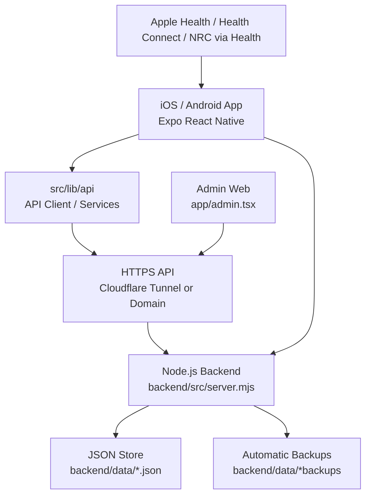
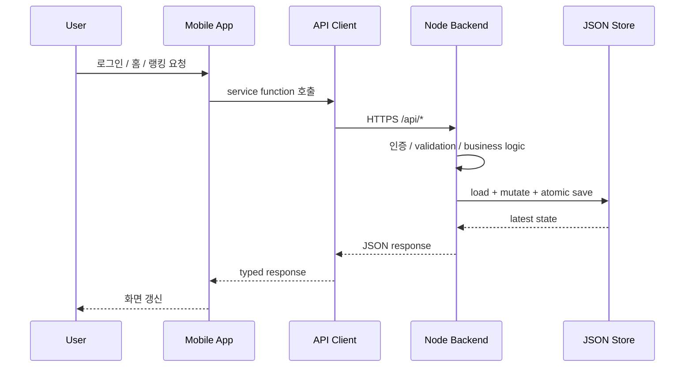
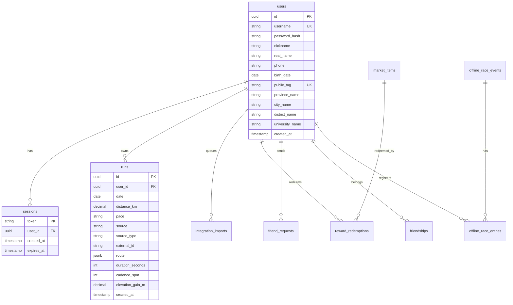
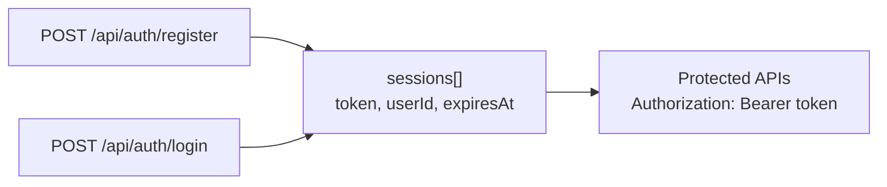
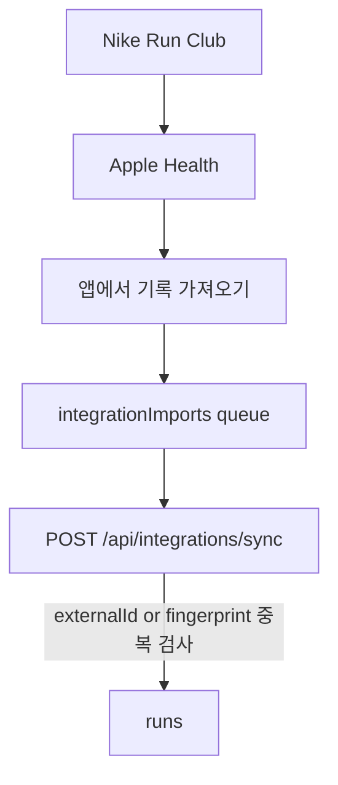
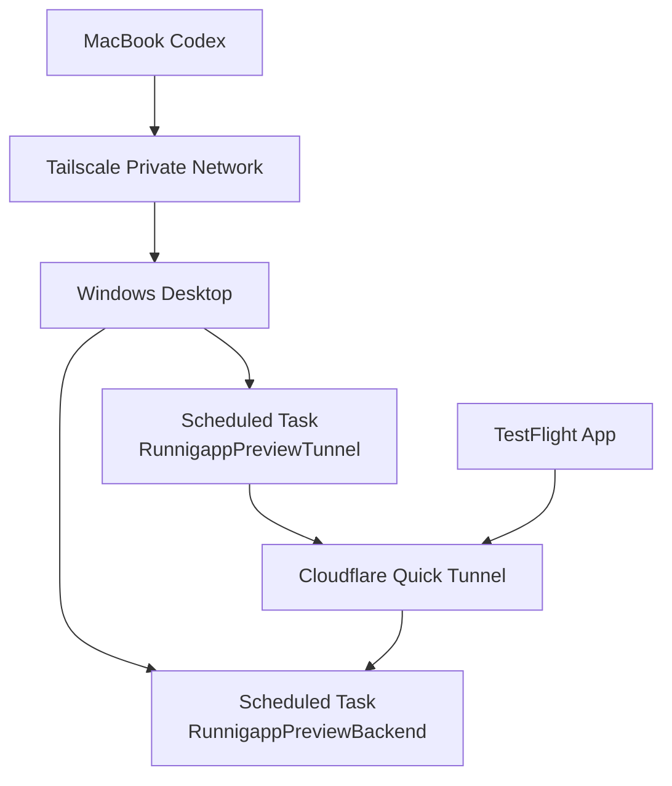
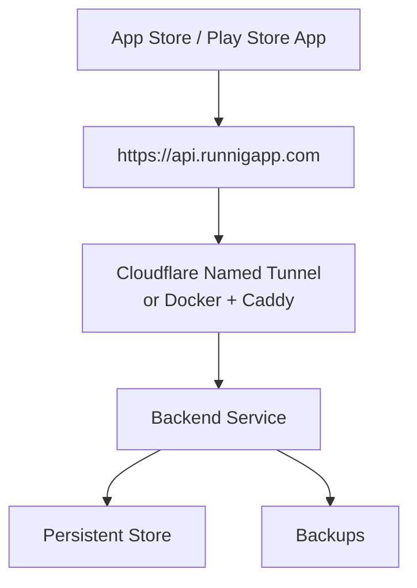
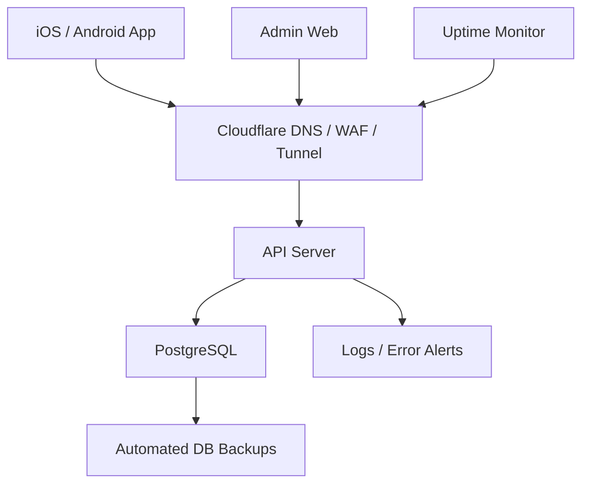

# Server / Backend Architecture

## 목적
RUNNIGAPP 백엔드는 출시 전 MVP에서 아래 역할을 맡는다.

- 회원가입, 로그인, 세션 관리
- 러닝 기록 저장과 조회
- 친구, 지역, 대학 랭킹 계산
- 기록 연동 import 중복 방지
- 마켓, 레이스, 관리자 운영 데이터 제공
- TestFlight / Preview 앱이 붙을 HTTPS API 제공

현재는 빠른 출시 검증을 위해 **Node.js 단일 서버 + JSON 파일 저장소**로 구성되어 있다. 다만 RUNNIGAPP은 출시 후 장기 운영해야 하므로, 이 구조는 최종 운영 구조가 아니라 **preview / MVP 검증용 임시 구조**로 본다.

장기 운영 목표는 아래와 같다.

- 고정 도메인 HTTPS API
- PostgreSQL 기반 영속 데이터베이스
- 관리되는 백업과 복구
- 서버 장애 자동 복구
- 로그, 모니터링, 장애 알림
- iOS와 Android가 같은 API를 쓰는 안정적인 운영 환경

## 전체 구조


## 기술 스택
| 영역 | 현재 기술 | 역할 |
| --- | --- | --- |
| 앱 | Expo, React Native, Expo Router | iOS/Android 공통 앱 |
| API Client | `src/lib/api/client.ts`, `services.ts` | 백엔드 호출, timeout, 에러 메시지 처리 |
| 세션 | `expo-secure-store` + 메모리 상태 | 로그인 토큰 저장 |
| 백엔드 런타임 | Node.js `http` 서버 | 별도 프레임워크 없이 API 처리 |
| 인증 | 자체 세션 토큰 + 비밀번호 해시 | 로그인, 로그아웃, 보호 API |
| 저장소 | JSON 파일 + atomic write | MVP용 영속 저장소 |
| 백업 | 저장 전 자동 백업 | JSON 손상/실수 복구 |
| Preview 공개 | Cloudflare Quick Tunnel | TestFlight 앱이 접근할 HTTPS 임시 주소 |
| 데스크탑 원격 제어 | Tailscale + SSH | 독서실/외부에서 집 데스크탑 서버 관리 |
| iOS 배포 | EAS Build, EAS Update, TestFlight | 빌드/OTA/테스트 배포 |

## 장기 운영 권장 스택
현재 구조에서 바로 모든 것을 갈아엎기보다는, 출시 안정성에 큰 영향을 주는 순서대로 운영 스택을 전환한다.

| 영역 | MVP 현재 | 장기 운영 권장 |
| --- | --- | --- |
| API 서버 | Node.js 단일 서버 | Node.js API 서버 유지, 서비스 계층 분리 |
| 저장소 | JSON 파일 | PostgreSQL |
| 파일 백업 | JSON 백업 파일 | DB 자동 백업 + 수동 복구 절차 |
| HTTPS | Cloudflare Quick Tunnel | Cloudflare Named Tunnel 또는 Docker + Caddy |
| 주소 | 매번 바뀌는 `trycloudflare.com` | `api.runnigapp.com`, `preview-api.runnigapp.com` |
| 실행 환경 | 집 데스크탑 | 초기에는 데스크탑 가능, 이후 VPS/클라우드 권장 |
| 관리자 인증 | 단일 admin token | 관리자 계정, 역할, 감사 로그 |
| 로그 | stdout/log file | 구조화 로그 + 에러 알림 |
| 모니터링 | 수동 health check | uptime monitor + 장애 알림 |

## 요청 흐름


## 백엔드 모듈 구조
| 파일 | 책임 |
| --- | --- |
| `backend/src/server.mjs` | HTTP 라우팅, 요청 validation, 응답 생성 |
| `backend/src/store.mjs` | JSON 저장소 load/save, migration, 백업, 복구 |
| `backend/src/auth.mjs` | 비밀번호 해시, 세션 만료 계산, 인증 검증 |
| `backend/src/config.mjs` | 환경 변수, 포트, public URL, timeout 설정 |
| `backend/src/points.mjs` | 러닝 포인트, 레벨, streak 계산 |
| `backend/src/routing.mjs` | 지도로 그림 그리기 경로 preview 보조 로직 |
| `backend/src/addressCatalog.mjs` | 전국 지역 카탈로그 |
| `backend/src/seed.mjs` | 초기 store 구조와 기본 카탈로그 생성 |
| `backend/src/smoke.mjs` | 출시 전 핵심 API smoke test |

## 핵심 도메인
현재 백엔드는 한 JSON store 안에 아래 데이터를 관리한다.

- `users`: 회원, 공개 닉네임, 비공개 실명, 지역, 대학, public tag
- `sessions`: 로그인 토큰과 만료 시각
- `runs`: 러닝 기록, source, sourceType, route, duration, cadence, elevation
- `integrationImports`: 외부 기록 가져오기 대기열과 중복 방지 대상
- `friendships`, `friendRequests`: 친구 관계와 요청
- `marketCatalog`, `rewardRedemptions`: 마켓 상품과 포인트 교환
- `offlineRaceEvents`: 실시간 오프라인 레이스 일정과 신청자
- `notices`: 관리자 공지

## 장기 데이터베이스 모델 방향
PostgreSQL로 넘어갈 때는 현재 JSON store의 배열을 그대로 테이블로 분리한다.



중요한 운영 규칙:
- `users.username`, `users.public_tag`는 unique index가 필요하다.
- 연동 기록 중복 방지를 위해 `(user_id, source_type, external_id)` unique index를 둔다.
- `external_id`가 없는 경우를 위해 날짜/거리/페이스 fingerprint index도 고려한다.
- 러닝 route는 초기에는 `jsonb`로 저장하고, 나중에 분석 기능이 커지면 별도 `route_points` 테이블로 분리한다.
- 실명, 전화번호, 상세 주소, 생년월일은 민감 정보로 분류하고 기본 API 응답에서 제외한다.

## 인증 구조


현재 인증 특징:
- 아이디는 `4~20자`, 영문 소문자/숫자/`-`/`_`만 허용한다.
- 비밀번호는 8자 이상, 영문과 숫자를 포함해야 한다.
- 실명은 `realName`으로 저장하고 일반 프로필 응답에는 노출하지 않는다.
- 앱 화면과 랭킹에는 `name`, 즉 닉네임만 보여준다.
- 세션은 JSON store의 `sessions`에 저장되고 만료 시간이 있다.

## 기록 연동 구조


현재 iPhone에서 가장 안정적인 흐름:
- NRC로 러닝 기록
- NRC가 Apple 건강 앱에 운동 기록 공유
- RUNNIGAPP에서 Apple Health 기록 가져오기
- 백엔드가 `externalId` 또는 날짜/거리/페이스 fingerprint로 중복 기록을 건너뜀

## Preview 운영 구조


현재 Preview 운영 방식:
- 데스크탑에서 백엔드와 Cloudflare Tunnel을 Windows 작업 스케줄러로 실행한다.
- 맥북은 Tailscale SSH로 데스크탑을 제어한다.
- `scripts/windows/start-preview-public-backend.cmd`로 새 HTTPS API 주소를 만든다.
- 새 주소를 EAS preview 환경 변수와 OTA 업데이트에 반영한다.

주요 명령:

```powershell
.\scripts\windows\start-preview-public-backend.cmd
.\scripts\windows\status-preview-public-backend.cmd
.\scripts\windows\stop-preview-public-backend.cmd
```

맥북에서 데스크탑 접속:

```bash
ssh desktop-runnigapp
```

## 출시 목표 구조
현재 Quick Tunnel은 주소가 바뀌는 임시 연결이다. 출시 안정성을 위해 목표 구조는 아래처럼 바꾸는 것이 좋다.



## 장기 운영 목표 구조


장기 운영 기준:
- 앱은 항상 고정 API 주소만 바라본다.
- preview와 production API를 분리한다.
- production 데이터는 PostgreSQL에 저장한다.
- 백업은 자동으로 만들고, 복구 리허설을 정기적으로 한다.
- 서버 health가 실패하면 알림이 온다.
- 관리자 작업은 누가 언제 무엇을 바꿨는지 남긴다.

## 전환 로드맵
### Phase 0. 지금 당장
- TestFlight가 현재 데스크탑 preview API에 안정적으로 붙는지 확인한다.
- 로그인, 회원가입, 홈 진입, 기록 가져오기, 친구 랭킹을 실제 기기에서 확인한다.
- `trycloudflare.com` 주소 변경 시 EAS preview OTA로 빠르게 갱신한다.

### Phase 1. 고정 Preview API
- 도메인을 준비한다.
- `preview-api.runnigapp.com`을 Cloudflare에 연결한다.
- Cloudflare Named Tunnel로 데스크탑 preview 서버를 고정 주소에 붙인다.
- TestFlight preview 앱은 이 주소만 바라보게 한다.

### Phase 2. 운영 저장소 전환
- PostgreSQL 스키마를 만든다.
- 현재 JSON store 데이터를 PostgreSQL로 옮기는 migration script를 만든다.
- API 서버가 JSON store와 PostgreSQL 중 하나를 선택해서 뜰 수 있게 adapter를 분리한다.
- smoke test를 PostgreSQL 환경에서도 통과시킨다.

### Phase 3. Production API
- `api.runnigapp.com`을 production API로 분리한다.
- production DB, preview DB를 분리한다.
- 자동 백업, 로그, uptime monitor를 붙인다.
- App Store / Play Store 제출 앱은 production API를 바라보게 한다.

### Phase 4. 운영 강화
- 관리자 계정/권한 모델을 만든다.
- 관리자 작업 감사 로그를 남긴다.
- 개인정보 삭제/탈퇴 처리 플로우를 만든다.
- 장애 대응 문서와 복구 절차를 정리한다.

## 현재 한계
현재 구조는 MVP 검증에는 빠르지만, 장기 운영에는 아래 한계가 있다.

- JSON 파일 저장소는 동시 요청이 많아지면 DB보다 약하다.
- Cloudflare Quick Tunnel은 주소가 바뀌고 uptime 보장이 없다.
- 관리자 기능은 토큰 기반이라 운영자 계정/권한 분리가 아직 없다.
- 실서비스 장애 알림, 로그 수집, 모니터링이 아직 부족하다.
- 백엔드가 단일 프로세스라 서버 장애 시 자동 복구 체계를 더 강화해야 한다.

## 다음 작업 추천
1. 고정 preview API 도메인 구성
2. `backend/db/schema.sql` 기준으로 PostgreSQL preview DB 준비
3. JSON store -> PostgreSQL migration script 준비
4. TestFlight에서 회원가입, 로그인, 홈 진입 실사용 검증
5. 관리자 페이지로 사용자/기록/레이스 운영 플로우 점검
6. 기록 가져오기 중복 방지와 Apple Health/NRC 흐름 재검증
7. Android preview 빌드와 동일 API 연결 검증
8. 출시 전 개인정보 처리방침, 이용약관, 위치/건강 권한 안내 정리

자세한 PostgreSQL 전환 계획은 `docs/postgres-transition-plan.md`에 정리한다.
